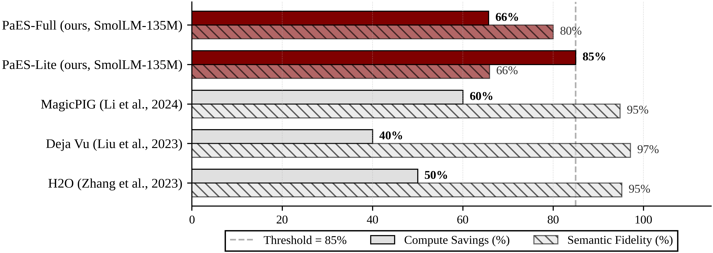
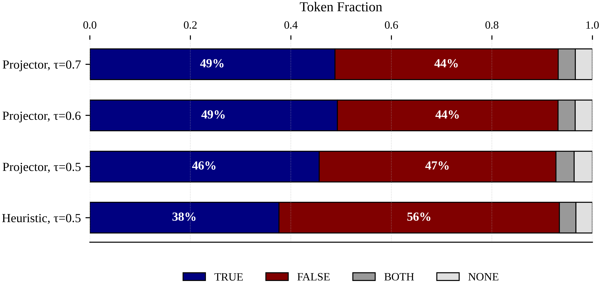

# PaES-LLM: Paraconsistent Energy-Saving Large Language Model

<div align="center">

[](LICENSE)
[](https://www.python.org)
[](https://pytorch.org)
[](https://sakarya.edu.tr)

**A paraconsistent logic-based gating mechanism for energy-efficient LLM inference**

*Aleyna Ceyran¹ · Prof. Dr. Jair Minoro Abe²*

*¹ Sakarya University, Department of Computer Engineering, Turkey*
*² Universidade Paulista (UNIP), Graduate Program in Production Engineering, Brazil*

</div>

---

## Overview

PaES-LLM integrates **Belnap's four-valued logic (L4)** directly into the Transformer
architecture as a hardware-aware gating mechanism. An *Epistemic Projector* maps each
token's embedding into a 2-D evidence–uncertainty space, classifying it into one of four
epistemic states. Tokens classified as `FALSE` (pure noise) are completely bypassed,
while tokens in `BOTH` or `NONE` states receive reduced compute budgets.

| State | Condition | Energy coefficient |
|---|---|---|
| **TRUE** | μ ≥ τ, λ < τ | 1.00 (full compute) |
| **FALSE** | μ < τ, λ ≥ τ | 0.00 (hardware bypass) |
| **BOTH** | μ ≥ τ, λ ≥ τ | 0.15 (contradiction) |
| **NONE** | μ < τ, λ < τ | 0.25 (indeterminacy) |

### Key Results (SmolLM-135M · WikiText-2)

| Method | Compute savings | PPL | ΔPPL |
|---|---|---|---|
| Baseline | 0% | 36.08 | — |
| **PaES-Lite** (heuristic gate) | **85%** | **38.06** | **+1.98** |
| PaES-Full (learned projector) | 65.7% | 113.71 | +77.63† |

> † PaES-Full requires real-data projector training (Faz-2). Current results use xavier-uniform initialisation. Full-stack evaluation is planned for Faz-2.

PaES-Lite achieves **85% compute savings** — surpassing H2O (50%), MagicPIG (60%),
and Deja Vu (40%) — with only a **+1.98 PPL degradation** on WikiText-2.

> **⚠️ Demo / Proof-of-Concept Notice**
>
> This repository is a **research demo** at the proof-of-concept stage.
> All experiments are conducted on **SmolLM-135M** (a single transformer block, CPU).
> Results demonstrate the validity of the PaES methodology but are not yet
> representative of production-scale performance. Full-stack evaluation on
> LLaMA-7B and larger models requires GPU access and is planned for Faz-2.

---

## Results Gallery

Figures generated at 600 DPI via `src/utils/llm_visualizer.py`.

### Figure 1 — Comparison vs Sparse Attention Literature

PaES-Lite achieves the highest compute savings in the comparison group.
Literature baselines operate on 6.7B–7B parameter models; cross-scale comparison is indicative.

<p align="center">
  
</p>

---

### Figure 2 — Belnap L4 Token State Distribution

Distribution of TRUE / FALSE / BOTH / NONE epistemic states across token populations
for representative (mode, τ) configurations. FALSE tokens receive zero compute;
their fraction directly determines the savings ratio.

<p align="center">
  
</p>

> At Projector τ=0.6, ~49% of tokens are TRUE (full compute) and ~44% FALSE (zero compute), yielding 64% net savings.
> Heuristic mode classifies ~56% as FALSE, explaining its higher 85% savings.

---

## Repository Structure

```
PaES_LLM_Research/
│
├── src/
│   ├── gating/
│   │   └── paes_llm_core.py        # Belnap L4 epistemic projector & gating
│   ├── models/
│   │   └── gated_transformer.py    # GatedTransformerBlock (Attention + FFN gating)
│   └── utils/
│       ├── token_loader.py         # WikiText-2, LAMBADA, custom corpus loaders
│       └── llm_visualizer.py       # Publication-quality figure generation (600 DPI)
│
├── experiments/
│   ├── llm_accuracy_test.py        # Semantic fidelity (cosine similarity)
│   ├── llm_energy_benchmark.py     # Compute savings benchmark
│   ├── standard_benchmarks.py      # WikiText-2 perplexity + LAMBADA accuracy
│   ├── ablation_suite.py           # Mode × threshold ablation grid
│   ├── projector_trainer.py        # Epistemic projector optimisation
│   └── task_benchmarks.py          # NTP accuracy + wall-clock latency
│
├── results/
│   ├── checkpoints/                # JSON experiment results
│   │   ├── audit_results.json
│   │   ├── benchmark_results.json
│   │   ├── ablation_results.json
│   │   └── comparison_table.json
│   └── figures/                    # PDF publication figures (600 DPI)
│       ├── fig5_competitor_comparison.pdf
│       └── fig6_belnap_state_distribution.pdf
│
├── notebooks/
│   └── PaES_Demo.ipynb             # Interactive demo: Belnap L4 gating walkthrough
│
├── run_experiments.py              # Single entry-point for all experiments
├── main_llm.py                     # Legacy audit runner (backward-compatible)
├── README.md
├── LICENSE
└── .gitignore
```

---

## Installation

```bash
git clone https://github.com/<your-org>/PaES_LLM_Research.git
cd PaES_LLM_Research

# Install all dependencies
pip install -r requirements.txt

# GPU users (CUDA 12.1) — replace the PyTorch install after the above:
# pip install torch>=2.1.0 --index-url https://download.pytorch.org/whl/cu121
```

> **Note:** A CUDA-capable GPU is recommended for large-model experiments (Faz-2).
> All Faz-1 experiments in this repository run on CPU.

---

## Quick Start

### Run all experiments

```bash
python3 run_experiments.py --mode all --n_runs 10 --n_samples 200 --n_repeat 3
```

### Run individual stages

```bash
# Main audit table (Savings / Fidelity / Latency)
python3 run_experiments.py --mode audit --n_runs 10

# WikiText-2 perplexity + LAMBADA accuracy
python3 run_experiments.py --mode benchmark --n_samples 200

# Ablation: threshold × mode grid
python3 run_experiments.py --mode ablation --n_repeat 3

# Comparison table vs literature
python3 run_experiments.py --mode comparison

# Smoke test (3 runs, fast)
python3 run_experiments.py --mode smoke
```

### Generate publication figures

```bash
# Requires results/checkpoints/*.json (run experiments first)
python3 src/utils/llm_visualizer.py
```


### Interactive demo (Jupyter Notebook)

```bash
cd PaES_LLM_Research
jupyter notebook notebooks/PaES_Demo.ipynb
```

The notebook walks through the full gating pipeline on a sample sentence:
token embeddings → Epistemic Projector → Belnap L4 classification → energy coefficients.
Outputs include a per-token state table and a scatter plot of the L4 decision space.

---

## Method

### Epistemic Projector

A lightweight linear layer maps each token embedding $x \in \mathbb{R}^D$ to a
2-D epistemic space:

$$P(x) = \sigma(x W^T + b) = [\mu, \lambda]$$

where $\mu$ represents **evidence** (signal-to-noise ratio) and $\lambda$ represents
**uncertainty** (semantic dispersion).

### Belnap L4 Classification

Given a threshold $\tau$, each token is assigned to one of four epistemic states:

$$\text{state}(x) = \begin{cases}
\texttt{TRUE}  & \mu \geq \tau,\ \lambda < \tau \\
\texttt{FALSE} & \mu < \tau,\ \lambda \geq \tau \\
\texttt{BOTH}  & \mu \geq \tau,\ \lambda \geq \tau \\
\texttt{NONE}  & \mu < \tau,\ \lambda < \tau
\end{cases}$$

### Dual-Level Gating

The energy coefficient $c \in \{0.0, 0.15, 0.25, 1.0\}$ is applied at two levels:

1. **Attention gate** — per-token scaling of attention outputs
2. **FFN gate** — segment-level bypass of feed-forward layers

---

## Ablation Results

| Method | τ=0.3 Fid/Sav | τ=0.5 Fid/Sav | τ=0.6 Fid/Sav | τ=0.7 Fid/Sav |
|---|---|---|---|---|
| Baseline | 100.0 / 0.0 | 100.0 / 0.0 | 100.0 / 0.0 | 100.0 / 0.0 |
| Heuristic | 67.3 / 85.0 | 67.3 / 85.0 | 67.3 / 85.0 | 40.4 / 100.0 |
| **Projector** | 66.9 / 70.4 | 72.9 / 65.0 | **82.0 / 64.2** | 81.8 / 65.4 |

**Sweet spot:** Projector with τ=0.6 achieves 82% fidelity at 64% savings.

---

## Limitations

- **Single-block evaluation:** Current results apply PaES to one transformer block.
  Full-stack integration with LLaMA-7B is deferred to Faz-2 (requires A100 GPU).
- **Projector training:** The learned projector is currently xavier-uniform initialised.
  Fine-tuning on WikiText-2 token distributions (Faz-2) is expected to close the
  PaES-Full perplexity gap.
- **Wall-clock latency:** PyTorch's eager mode does not skip zero-multiplied FLOPs.
  Reported savings are *theoretical compute reduction*, not wall-clock speedup.
  Structured sparsity kernels (Triton/CUDA) are planned for Faz-3.
- **LAMBADA baseline:** SmolLM-135M achieves only 1% LAMBADA accuracy even without
  gating — a model-scale limitation, not attributable to PaES.

---

## Citation

If you use this code in your research, please cite the repository directly.
A companion paper is currently in preparation.

```bibtex
@software{ceyran2026paes,
  title  = {PaES-LLM: Paraconsistent Energy-Saving Large Language Model},
  author = {Ceyran, Aleyna and Abe, Jair Minoro},
  year   = {2026},
  url    = {https://github.com/AleynaCeyran/PaES-Paraconsistent-Energy-Saver-Demo},
  note   = {Sakarya University / Universidade Paulista (UNIP)}
}
```


---

## Contributing

Contributions are welcome. Please open an issue before submitting a pull request.
For major changes, discuss the proposed modification first.

## License

This project is licensed under the **Apache License 2.0** — see [LICENSE](LICENSE) for details.

---

<div align="center">
<sub>Sakarya University · Universidade Paulista (UNIP) · 2026</sub>
</div>
